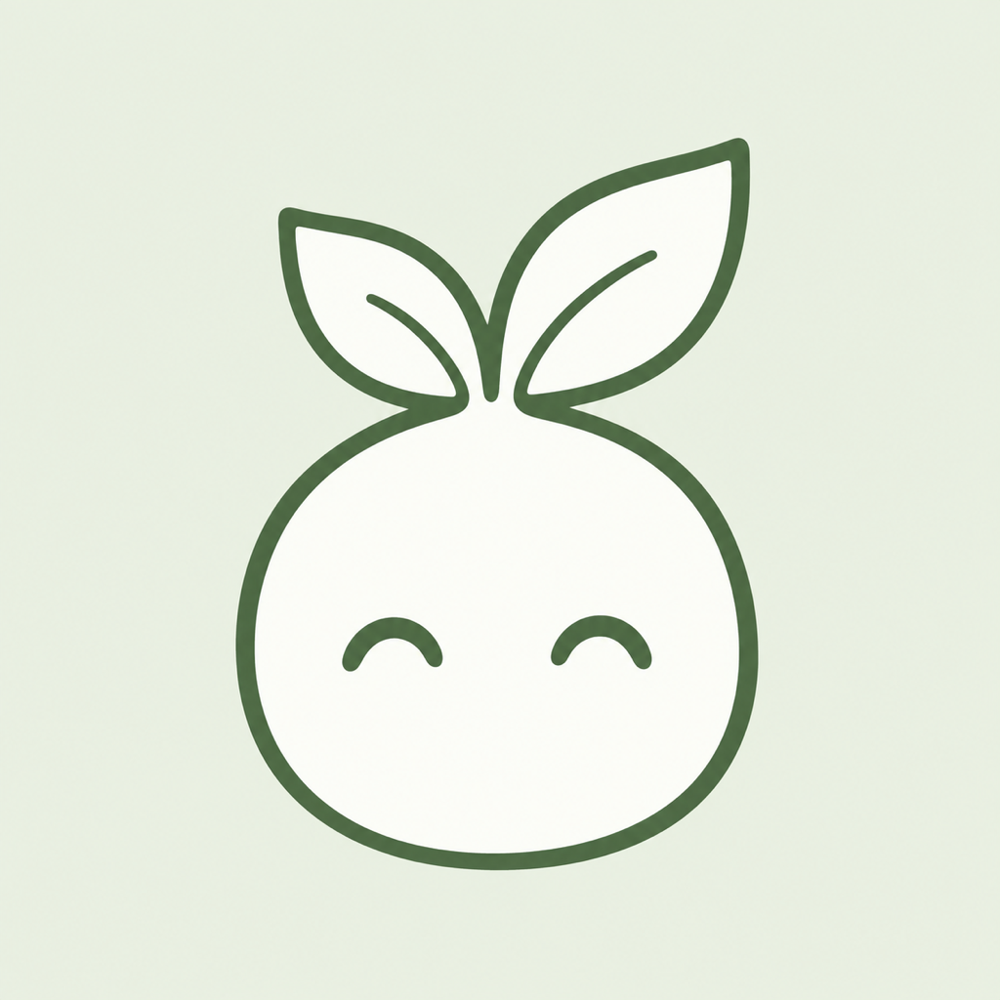
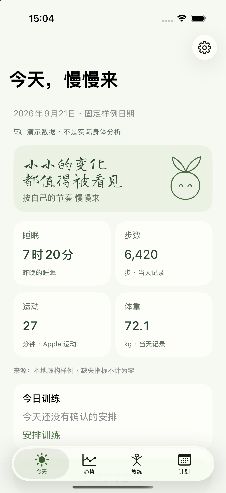
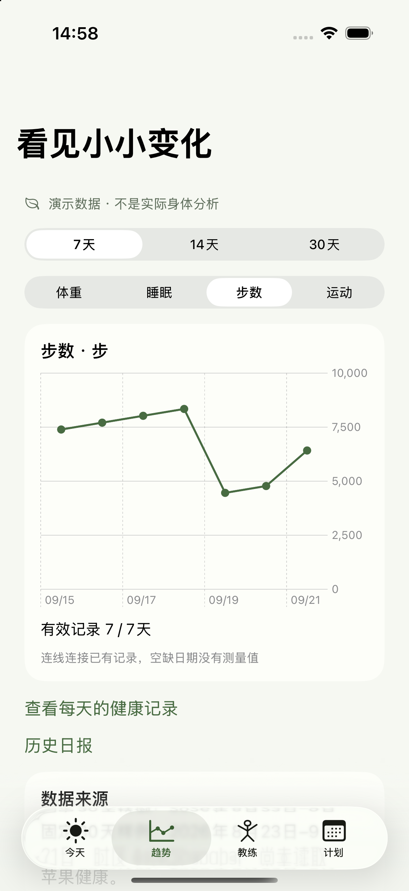
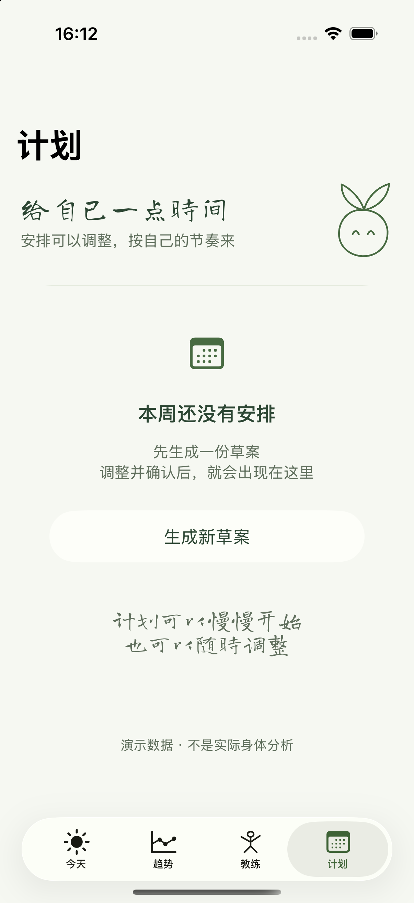

# Steady

**一本记录每天小变化的健康日记。**

[English](README.md) · 简体中文

Steady 把每天的感受、苹果健康趋势和训练计划放在一起。先记下今天的状态，再看看最近的睡眠和活动，决定下一步怎么安排。你也可以按需开启 AI，了解健康摘要，生成一份能修改、需要自己确认的训练草案。

使用 SwiftUI 构建，支持 iOS 18 及以上版本，当前应用界面为简体中文。

<p>
  
  
  
</p>

*截图均使用虚构的演示数据。*

## 可以做什么

- **记下每天的感受。** 保存当天的补记，回看已生成的健康日报。
- **看清最近的变化。** 授权后读取苹果健康中的体重、睡眠、步数和 Apple 运动分钟，查看 7、14、30 天趋势及逐日记录。没有数据的指标保留为空，不算作零。
- **聊聊身体状态。** 按需开启 AI，根据健康摘要生成日报，或向教练提问。
- **安排适合自己的训练。** 先修改、确认草案，再加入计划；之后可以调整训练日期和动作，记录完成情况、主观强度与感受。

界面保留原生导航和表单，提供浅色与深色外观、少量手写字体，以及轻点就会换表情的叶芽。

## 数据用途由你决定

无需注册账户，也可以在本机补记和使用已有记录。以下三项分别授权，**默认全部关闭**：

| 功能 | 开启后允许的操作 |
| --- | --- |
| 苹果健康 | 读取支持的健康指标，在设备上整理每日摘要。 |
| 云端同步 | 通过配置的 Supabase 后端同步摘要和日记记录。 |
| AI 教练 | 将生成日报、对话或计划所需的上下文，经后端发送给 AI 服务。 |

登录不会自动开启这些功能。HealthKit 原始样本留在设备上，云同步使用整理后的摘要。不开启云同步，也可以单独同意 AI 处理。关闭同步会停止后续同步，但不会删除已有云端记录。

日报和教练建议用于了解记录，不提供医疗诊断。

## 本地运行

需要 macOS、支持 Swift 6 的 Xcode，以及 iOS 18+ 模拟器或 iPhone。运行 Swift 包测试需要 macOS 15 或以上版本。

```sh
git clone https://github.com/fengfe1125/steady.git
cd steady
open Steady.xcodeproj
```

1. 选择 **Steady** Scheme 和 iPhone 模拟器，运行应用。
2. 若想先体验虚构样例，在 **Edit Scheme → Run → Arguments Passed On Launch** 中添加 `--demo`。演示模式不会读取苹果健康、同步记录或调用 AI。
3. 移除 `--demo` 后进入真实的本地日记模式。真实健康读取应使用有苹果健康记录的 iPhone 验证；真机构建需配置自己的签名。

本地功能不需要云端配置。邮箱登录、云同步和真实 AI 需要配置后端，详见[开发说明](docs/live-development.md)和[后端契约](docs/backend-contract.md)。[客户端配置脚本](scripts/configure_client.py)会从本地环境文件生成被 Git 忽略的 `Steady/CloudConfig.plist`。

在项目根目录运行 Swift 测试：

```sh
swift test
```

## 当前进度

Steady 仍在开发中。[v0.1.0-alpha.1](https://github.com/fengfe1125/steady/releases/tag/v0.1.0-alpha.1) 为**源码预览版**，不含签名安装包或 TestFlight 构建。该版本的 Swift 测试和 iOS 模拟器编译已通过；最终真机验收、跨设备恢复和完整 UI 验收仍在进行。

## 项目结构

| 路径 | 内容 |
| --- | --- |
| `Steady/` | SwiftUI 页面、应用状态、主题与内置字体。 |
| `Sources/SteadyCore/` | 数据模型、本地存储、服务协议与演示数据。 |
| `Sources/SteadyLive/` | HealthKit、账户、同步和 AI 服务实现。 |
| `supabase/` | 后端函数、数据库迁移与数据库测试。 |
| `Tests/` · `SteadyUITests/` | Swift 单元测试与 iOS UI 测试。 |

内置字体 [Caveat](Steady/Fonts/Caveat-OFL.txt) 与 [Long Cang](Steady/Fonts/LongCang-OFL.txt) 使用 SIL Open Font License 1.1，授权文本随项目提供。
